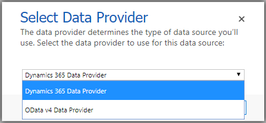

# Data Providers

## Overview
This project provides custom data providers for use with Virtual Entities in Dynamics 365.  These data providers can be used to connect to data sources other than the out-of-the-box OData V4 data provider.

   

### Providers

#### Dynamics 365

The Dynamics 365 Data Provider allows you to pull in data from another Dynamics 365 environment.  This is useful in scenarios where your organization has separate environments for sales and service.

Ffiltering, sorting, and paging are fully supported.  However, linked entities are not yet supported.

## Configuration
Please refer to the [configuration](./docs/CONFIGURE.md) documentation.