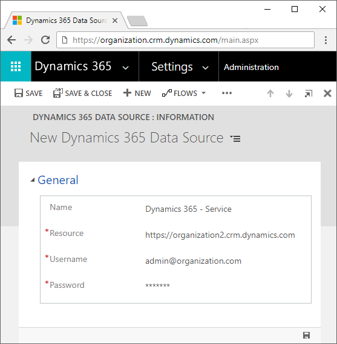
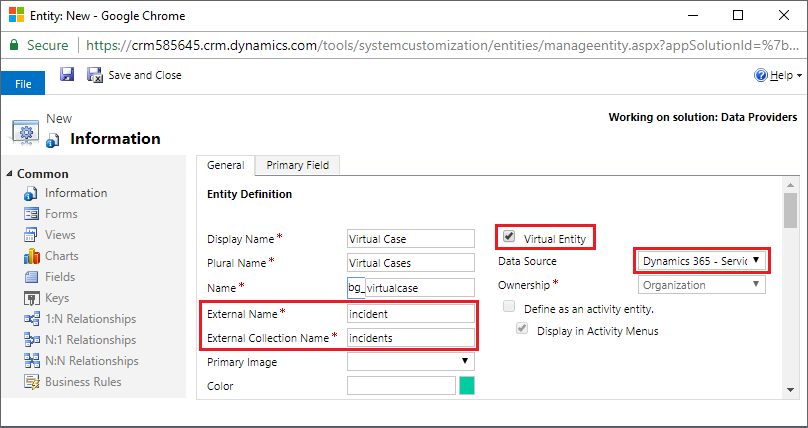
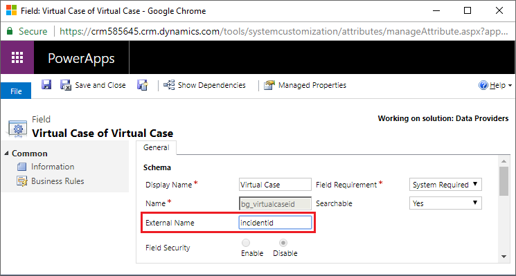

# Installation

1. Download the solution from the [Releases](../../../releases).

2. Go to Settings > Solutions, click Import.
 
3. Follow the prompts to import the `DataProviders_X_X_X_X_managed.zip` file.

# Configuration

## Data Source

Before you can create a virtual entity, you must first configure a Data Source.

1. Go to Settings > Administration > Virtual Entity Data Sources.

2. Add a new Data Source, selecting the appropriate Data Provider.

   

3. Populate the necessary fields on the new Data Source.

   

## Virtual Entity

1. Go to Settings > Solutions, and open your solution.

2. Create a new entity.

   

3. Save and open the Fields.

5. Update the Extenral Name properties of each field.

   

6. Create additional fields, if necessary.

7. Publish the entity.